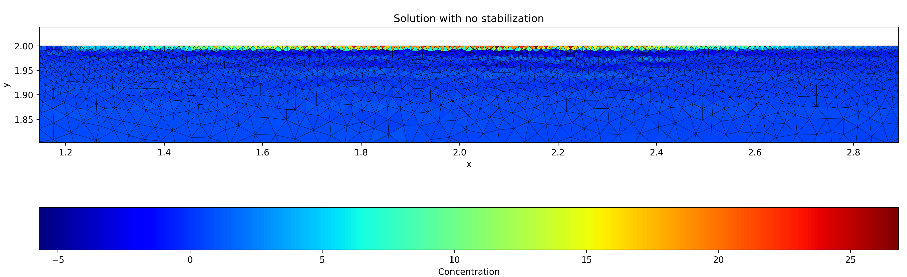
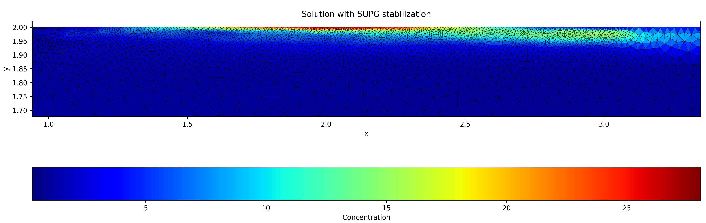

# River Pollution
_How can we stabilize Finite Element solutions with streamline diffusion?_

This project is a bottom-up Python implementation of the Finite Element Method (FEM) applied to a river pollution problem. The main focus is on the destabilizing effect of convection-dominated flows and the effectiveness of the SUPG stabilization technique (streamline diffusion).

  **Note:** Some of the functions for the discretization procedure are taken from the [EPFL Numerical Approximation of PDE](https://edu.epfl.ch/coursebook/en/numerical-approximation-of-pdes-MATH-451) course.

 

  
  

