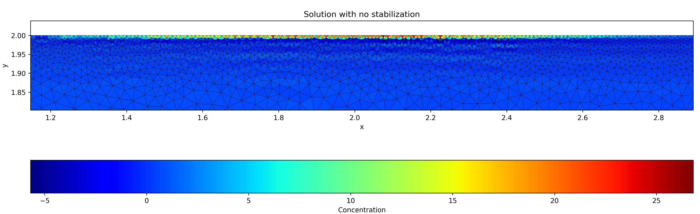
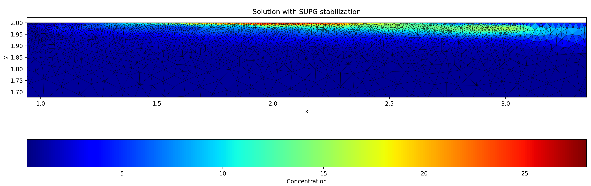

<div align="center">

# 🏞️ River Pollution

### _How can we stabilize Finite Element solutions with streamline diffusion?_


</div>

This project is a bottom-up Python implementation of the Finite Element Method (FEM) applied to a river pollution problem. The main focus is on the destabilizing effect of convection-dominated flows and the effectiveness of the SUPG stabilization technique (streamline diffusion).

> **Note:** Some of the functions for the discretization procedure are taken from the [EPFL Numerical Approximation of PDE](https://edu.epfl.ch/coursebook/en/numerical-approximation-of-pdes-MATH-451) course.

<br>
<div align="center">
  
  <br>
  <em>Standard Galerkin solution — spurious oscillations pollute the result</em>
  <br><br>
  
  <br>
  <em>SUPG-stabilized solution — clean, physically meaningful concentration field</em>
</div>
<br>

## 📋 Table of contents

- [Problem description](#-problem-description)
- [Why stabilization?](#-why-stabilization)
- [Repository structure](#-repository-structure)
- [Requirements](#-requirements)
- [Usage](#-usage)

## 🌊 Problem description

A factory located on the bank of a river discharges a pollutant into the water. The steady-state pollutant concentration $c$ in the rectangular river domain is modeled by a convection–diffusion–reaction equation

$$-\mu \Delta c + \boldsymbol{u} \cdot \nabla c + \sigma c = 0,$$

with a parabolic (Poiseuille-like) streamwise velocity profile $u_1(y) = U_M \, y (W - y)$, complemented by:

- **Dirichlet** conditions at the upstream inlet ($c = C_{up}$) and along the factory outlet ($c = C_{in}(x)$),
- **Robin** conditions on the river banks, modeling exchange with the dry land: $\mu \, \partial_n c = \alpha (C_{dry} - c)$,
- a free (homogeneous Neumann) condition at the downstream outlet.

A detailed derivation and discussion of the results can be found in [report.pdf](report.pdf).

## ⚡ Why stabilization?

Since the diffusivity is very small ($\mu = 10^{-6}$) while the velocity is large, the problem is strongly **convection-dominated**: the element Péclet number is far above 1, and the standard Galerkin FEM behaves like an unstable central-difference scheme — the solution is polluted by spurious node-to-node oscillations (first figure above).

**SUPG** (Streamline Upwind Petrov–Galerkin) fixes this by adding a consistent amount of artificial diffusion *only along the streamlines*, leaving the crosswind direction untouched. This suppresses the oscillations without smearing the solution the way isotropic artificial diffusion would (second figure above). The stabilization strength is controlled by the parameter `gamma` in `solve_SUPG_stabilization`.

The code also runs a **mesh-convergence study**: the total pollutant concentration $Q_h = \int_\Omega c_h \, d\Omega$ is computed for a sequence of decreasing mesh sizes $h$, and the error is compared against first- and second-order reference slopes.

## 📂 Repository structure

| File | Description |
| --- | --- |
| `main.py` | Entry point: sets the physical parameters, builds the mesh, solves the problem with and without SUPG stabilization, and runs a mesh-convergence study on the total pollutant concentration. |
| `FactoryMesh.py` | Generates the river mesh with local refinement near the boundaries and the factory outlet (Gaussian-graded mesh size). |
| `mesh.py` | `Triangulation` class wrapping `pygmsh`/`meshio` mesh generation and mesh-related quantities. |
| `integrate.py` | Element-wise assembly of the mass, stiffness, transport, and SUPG stabilization matrices, plus Neumann/Robin boundary terms. |
| `solve.py` | Linear system solution with imposition of Dirichlet boundary data. |
| `quad.py` | Gaussian quadrature rules on triangles (seven-point, order 6). |
| `util.py` | Small numpy helpers used throughout the codebase. |
| `report.pdf` | Full project report with the mathematical formulation and results. |

## 🔧 Requirements

The code requires Python 3 with the following packages:

```
numpy scipy matplotlib pygmsh meshio torch
```

Install them with:

```bash
pip install numpy scipy matplotlib pygmsh meshio torch
```

## 🚀 Usage

Run the main script from the repository root:

```bash
python main.py
```

This will:

1. generate and plot the locally refined mesh,
2. solve and plot the unstabilized Galerkin solution,
3. solve and plot the SUPG-stabilized solution,
4. run a convergence study of the integrated pollutant concentration for decreasing mesh size $h$.

The mesh resolution and the physical parameters (river geometry, velocity, diffusivity, reaction rate, etc.) can be adjusted at the top of `main.py`, and the SUPG stabilization strength via the `gamma` argument of `solve_SUPG_stabilization`.
